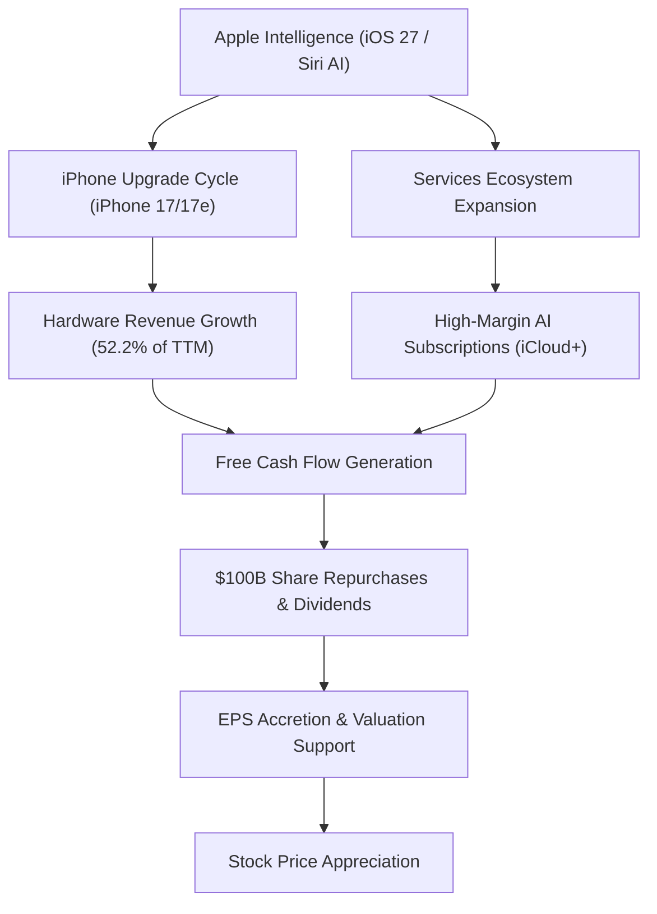

# Apple Inc. (AAPL) Comprehensive Stock Estimation Report

**Report Date:** June 20, 2026  
**Current Price:** $298.01 USD *(As of June 18, 2026 close)*  
**Consensus Rating:** Buy / Outperform  
**Estimated 12-Month Price Target:** **$325.50** *(Base Case)* | **$383.80** *(Bull Case)* | **$255.00** *(Bear Case)*  

---

## 1. Executive Summary
Following the Worldwide Developers Conference (WWDC) in June 2026, Apple Inc. (AAPL) has successfully transitioned its AI initiatives into a core monetization driver. Underpinned by the launch of **iOS 27**, **Siri AI**, and a key multi-year partnership integrating **Google Gemini** as its backend reasoning layer, Wall Street is re-evaluating Apple's growth premium. 

Over the Trailing Twelve Months (TTM) ended March 28, 2026, Apple generated **$451.51 billion** in revenue and **$122.60 billion** in net income (TTM EPS of **$8.27**), demonstrating robust acceleration from fiscal year 2025. This report combines fundamental, technical, and valuation indicators to estimate Apple's stock trajectory over the next 12 months.

---

## 2. Catalyst Flow: The AI Upgrade Loop
The diagram below illustrates how Apple's core business segments feed into the high-margin Services growth and capital return models.

---

## 3. Financial Fundamentals (TTM Ending March 2026)
Apple's fundamental health is characterized by expanding top-line revenue and industry-leading margins.

### Table 1: Key Segment Revenues (TTM)
| Segment | TTM Revenue (USD Billions) | % of Total Revenue | Year-over-Year Trajectory |
| :--- | :--- | :--- | :--- |
| **iPhone** | $235.86B | 52.2% | +23% YoY peak in Q1 FY26 (Holiday upgrade wave) |
| **Services** | $117.16B | 26.0% | +13-14% YoY secular expansion |
| **Mac** | $33.57B | 7.4% | Stabilized; driven by MacBook Neo launches |
| **iPad** | $29.04B | 6.4% | Upward momentum via M4 iPad Air releases |
| **Wearables, Home & Acc.** | $35.80B | 7.9% | Resilient holiday demand, neutral mid-year |
| **Total** | **$451.43B** | **100.0%** | **Total TTM Growth: +12.8%** |

> [!NOTE]
> The **Services** segment remains Apple's highest margin contributor, benefiting directly from premium iCloud+ bundles, transaction fees facilitated by Siri AI, and App Store commissions from third-party generative AI software.

---

## 4. Technical Metrics & Wall Street Consensus
Apple's technical setup is strong, with the stock consolidating healthy gains following its all-time high of **$317.40** on June 8, 2026.

### Table 2: Technical Indicators
| Technical Metric | Value / Range | Assessment |
| :--- | :--- | :--- |
| **52-Week Range** | $196.86 – $317.40 | AAPL trades in the upper quartile, showing strong relative strength. |
| **50-Day SMA** | $285.49 – $289.73 | Active short-term support; trading comfortably above this level. |
| **200-Day SMA** | $266.87 – $272.98 | Strong long-term support indicating a structural bull market. |
| **RSI (14 Days)** | 47 – 53 | Neutral; indicates room for upward movement without being overbought. |

### Table 3: Selected Wall Street Price Targets
*   **Average Consensus Target:** **$310.00 – $314.59**
*   **High Analyst Target:** **$400.00** *(Wedbush - Dan Ives)*
*   **Low Analyst Target:** **$200.00 – $215.00**

| Firm | Target Price | Rating | Key Thesis |
| :--- | :--- | :--- | :--- |
| **Wedbush** | $400.00 | Outperform | Massive upgrade cycle across active global base due to Apple Intelligence. |
| **Melius Research** | $385.00 | Buy | Monetization of advanced Siri capabilities via consumer subscriptions. |
| **BofA Securities** | $380.00 | Buy | Strong pricing power offsets chip (DRAM/NAND) supply-chain cost inflation. |
| **Morgan Stanley** | $360.00 | Overweight | High confidence in device replacement frequency driven by on-device AI. |
| **JPMorgan** | $325.00 | Overweight | Cyclical device refresh cycle provides positive tailwinds for FY27. |

---

## 5. Valuation Scenarios (12-Month Horizon)
Given the current TTM EPS of **$8.27**, Apple trades at a trailing price-to-earnings (P/E) multiple of **36.0x**. Based on estimated FY2027 EPS models, we outline three potential scenarios for AAPL's stock price over the next year:

### Table 4: Multi-Scenario Price Estimation Model
| Scenario | Estimated FY27 EPS | Target P/E Multiple | Estimated Target Price | Projected Return | Key Assumptions |
| :--- | :--- | :--- | :--- | :--- | :--- |
| **Bull Case** | $10.10 | 38.0x | **$383.80** | **+28.8%** | Apple Intelligence sparks a super-cycle; hardware margins expand; rapid adoption of premium AI iCloud packages. |
| **Base Case** | $9.30 | 35.0x | **$325.50** | **+9.2%** | Steady upgrades driven by iOS 27 features; services grow at a stable 13% rate; $100B buyback reduces share count. |
| **Bear Case** | $8.50 | 30.0x | **$255.00** | **-14.4%** | Tariffs compress gross margins; components costs (memory/silicon) continue rising; antitrust pressure limits App Store fees. |

---

## 6. Key Investment Risks
Investors must balance Apple's valuation premium against three distinct structural headwinds:
1.  **Antitrust Enforcement:** The DOJ's domestic smartphone lawsuit, EU DMA compliance, and Brazil's regulatory order forcing the opening of iOS to alternative payments represent major risks to the high-margin App Store ecosystem.
2.  **Supply Chain Shift Costs:** While assembly is shifting to India (now 25% of global iPhone assembly) and Vietnam (MacBooks/Wearables), the capital-intensive transition and ongoing tariffs on components continue to squeeze gross margins.
3.  **Advanced Silicon Costs:** Integrating high-performance unified memory and NPUs to run 70B-parameter models locally increases bill-of-materials (BOM) costs.

---
*Disclaimer: This report is for analytical purposes only and does not constitute formal investment advice.*
